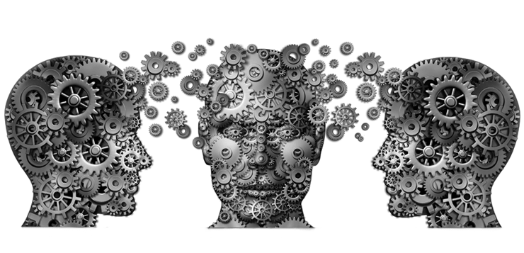
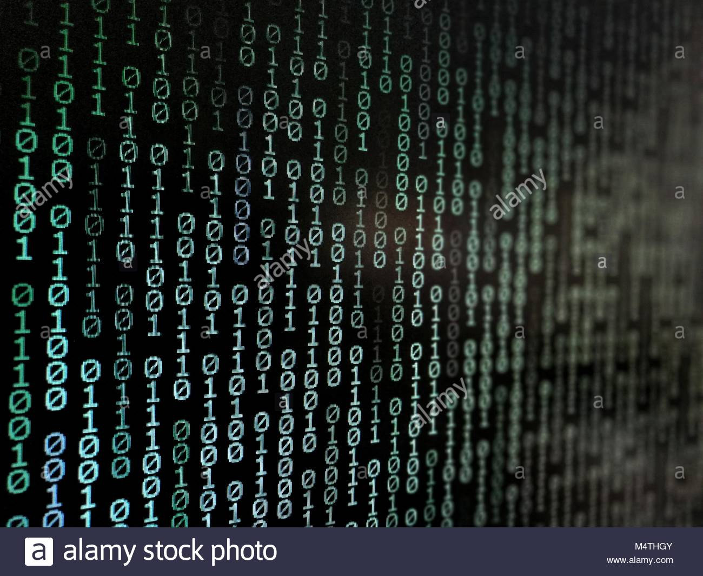
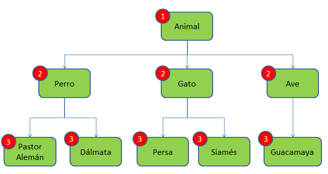
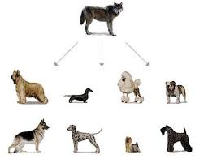
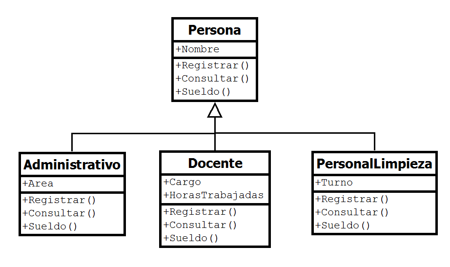

# Tarea 1: Introducción al paradigma de la programación orientado a objetos

## Paradigma

A lo que entiendo __paradigma__ se refiere a que hace igual algo; o que tiene un fin común.

## Abstracción

Según yo entiendo en __abstracción__ es extraer algo de su contexto y darle uno común significado que puede ser diferente al actual.

## ¿Por qué decimos que la Clase es el mecanismo de abstracción de los lenguajes OO?

Decimos que es un mecanismo de abstracción debido a que nombramos las clases de objetos u personas que existen en el mundo, las sacamos de su contexto normal y lo metemos a uno informatico que la computadora y el programador pueda entender.

## Explica el concepto de encapsulamiento, busca dos imágenes que te ayuden a describir el concepto, una que tenga algún sistema sin encapsulamiento y otra donde si lo tenga. Menciona por que es importante y que problemas puede evitar.

El __Encapsulamiento__ se encarga de mantener ocultos los procesos internos que necesita para hacer los que sea que haga, dandole al programa el acceso que solo necesita.

El encapsulamiento es importante en el momento de programar; ya que si lo utilizamos en programas mas grandes podriamos dar acceso indeseado a contraseñas de usuarios 

## Describe con tus palabras el concepto de herencia e ilustra el concepto con imágenes.

La __herencia__ es lo que se hereda de un ser vivo; en computacion se refiere a los metodos de una clase mayor que sea igual o derivado de la clase principal, lo que seria de una clase humano que tenga el metodo de caminar; esta se heredaria a la sub-clase de Adulto en la cual no se necesita declarar un metodo caminar; Cabe decir que la herencia no se hace sola; en C# es necesario poner ":" entre las dos clases primero el que hereda y el que sigue es el que da la herencia.

## Curso UML: Diagrama de clases

## Resumen de la hisotria del UML

El lenguaje __UML__ comenzó a desarrollarse en octubre de 1994, cuando __Rumbaugh__ se unió a la compañía Rational fundada por __Booch__. El objetivo de ambos era unificar dos métodos que habían desarrollado: el método Booch y el OMT (Object Modelling Tool ). El primer borrador apareció en octubre de 1995. En esa misma época otro investigador, __Jacobson__, se unió a Rational y se incluyeron ideas suyas. Estas tres personas son conocidas como los __“tres amigos”__. Además, este lenguaje se abrió a la colaboración de otras empresas para que aportaran sus ideas. Todas estas colaboraciones condujeron a la definición de la primera versión de UML

Es un lenguaje de modelado visual que se usa para especificar, visualizar, construir y documentar artefactos de un sistema de software. Se usa para entender, diseñar, configurar, mantener y controlar la información sobre los sistemas a construir.
UML capta la información sobre la estructura estática y el comportamiento dinámico de un sistema. Un sistema se modela como una colección de objetos discretos que interactúan para realizar un trabajo que finalmente beneficia a un usuario externo.
El lenguaje de modelado pretende unificar la experiencia pasada sobre técnicas de modelado e incorporar las mejores prácticas actuales en un acercamiento estándar.
UML no es un lenguaje de programación. Las herramientas pueden ofrecer generadores de código de UML para una gran variedad de lenguaje de programación, así como construir modelos por ingeniería inversa a partir de programas existentes.

El UML o Lenguaje Unificado de Modelado, es un estandar para el desarrollo de software que sirve para mejorar la comunicacion entre programadores y tambien sirve para crear un modelo de la estructura de un programa; UML consta de 13 diagramas:

1. Diagrama de clases.
2. Diagrama de casos de uso
3. Diagrama de secuencias
4. Diagrama de componentes
5. Diagrama de objetos
6. Diagrama de interaccion
7. Diagrama de estructura compuesta
8. Diagrama de despliegue
9. Diagrama de paquetes
10. Diagrama de actividades
11. Diagrama de estados
12. Diagrama de comunicacion
13. Diagrama de tiempo

## ¿Sabes de alguna empresa local que utilice este lenguaje?

No

## Escribe una propuesta de una máquina que venda distintos artículos y haz el diagrama de clases del sistema que propones. 

